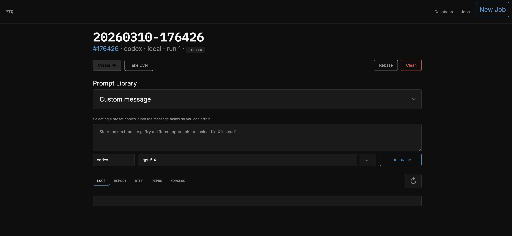

# ptq — PyTorch Job Queue

CLI tool that takes a GitHub issue number, SSHs into a remote GPU machine, and launches an agent (Claude/Codex/Cursor) to autonomously investigate and fix the bug. The agent produces a report and a diff that you can review and turn into a PR.

## Install

No install step needed — just use `uv run`:

```bash
cd pt_job_queue
uv run ptq --help
```

For development (tests, web dashboard):

```bash
uv run --extra dev pytest
uv run ptq web
```

### UBER SPEED MODE GETING STARTED
Assumes you have uv installed otherwise: `curl -LsSf https://astral.sh/uv/install.sh | sh`

```bash
git clone git@github.com:drisspg/pt_job_queue.git

# This will take a second
uv run ptq setup --local --build
uv run ptq run -m "tell me a story" --agent codex
```


## Usage

### 1. Set up a machine

```bash
# Remote GPU machine (auto-detects CUDA version)
uv run ptq setup my-gpu-box

# Remote with explicit CUDA version
uv run ptq setup my-gpu-box --cuda cu130

# Local (for testing/development)
uv run ptq setup --local --cpu
```

This creates a workspace with:
- A `uv`-managed venv with PyTorch nightly
- A pytorch source clone at the matching nightly commit
- Helper scripts for applying fixes to site-packages

When `--build` is used, setup performs a full checkout nuke before editable install (`git clean -dfx` + submodule sync/update) to avoid stale CMake/Ninja graphs after upstream file moves.

**Speed up C++ rebuilds:** Install system NCCL to skip building it from source (~5 min savings per rebuild):

```bash
sudo apt install -y libnccl-dev
```

Then add to `~/.ptq/config.toml`:

```toml
[build.env]
USE_SYSTEM_NCCL = "1"
```

### 2. Create a named worktree

```bash
# On a remote machine
uv run ptq worktree flex-attn --machine my-gpu-box

# Locally (default when no --machine)
uv run ptq worktree my-fix --local

# With verbose build output
uv run ptq worktree stride-fix --machine my-gpu-box -v
```

Creates a PyTorch git worktree with a ready-to-use venv, without launching an agent. Useful when you want to work in the worktree yourself or defer agent launch. The command prints the shell command to enter the worktree.

Later, launch an agent in the same worktree by name:

```bash
uv run ptq run flex-attn -m "optimize the CPU codegen"
```

The worktree shows up in `ptq list` and can be cleaned with `ptq clean` like any other job.

### 3. Launch an investigation

```bash
# On a remote machine
uv run ptq run --issue 174923 --machine my-gpu-box

# Locally
uv run ptq run --issue 174923 --local

# Run in background (don't stream output)
uv run ptq run --issue 174923 --machine my-gpu-box --no-follow

# Ad-hoc task (no issue, just a message)
uv run ptq run --machine my-gpu-box -m "Optimize the flex attention CPU codegen"

# Issue + extra context
uv run ptq run --issue 174923 --machine my-gpu-box -m "Focus on the stride logic"

# Use a preset template from the prompt library
ptq run --issue 174923 --machine my-gpu-box -p diagnose_and_plan

# Preset + extra instructions (appends your -m text)
ptq run --issue 174923 --machine my-gpu-box -p fix_and_verify -m "focus only on scaled_mm path"

# Use a different agent
uv run ptq run --issue 174923 --machine my-gpu-box --agent cursor --model gpt-5.3-codex-xhigh-fast
```

The agent will:
1. Reproduce the bug using a repro script extracted from the issue
2. Read pytorch source to find the root cause
3. Apply a minimal Python-only fix
4. Test the fix by copying edits to site-packages and re-running the repro
5. Write `report.md` and `fix.diff`

Re-running the same issue reuses the existing worktree and preserves prior edits. Each run gets its own log (`claude-1.log`, `claude-2.log`, ...). Different issues run concurrently via separate git worktrees.

### 4. Web dashboard

```bash
uv run ptq web
# or on a custom port
uv run ptq web --port 9000
```

The web UI lets you:
- Launch jobs (issue-based or ad-hoc) with agent/model/machine selection
- Fill the message box from a built-in prompt library for `Repro Only`, `Diagnose And Plan`, and `Fix And Verify`
- Monitor live logs via streaming
- View reports, diffs, and worklogs
- Follow up on stopped jobs with steering messages
- **Take Over** — copies an SSH command that drops you into the job's worktree with the venv activated
- Create PRs directly from the UI

### Web UI preview

> Add a screenshot at `docs/assets/web-ui.png` and this README will render it automatically.



The prompt library is backed by `~/.ptq/config.toml`.

- Built-ins are always available and can be overridden under `[prompt_library.builtin.<name>]`
- User presets can be added under `[prompt_library.custom.<name>]`

List everything available from CLI with:

```bash
ptq presets
```

### 5. Monitor progress (CLI)

```bash
# Peek at the agent's worklog
uv run ptq peek 174923

# Peek with recent log activity
uv run ptq peek 174923 --log 30

# List all jobs with running/stopped status
uv run ptq list
```

The agent maintains a `worklog.md` with entries after each significant step, so you can check progress without streaming the full output.

### 6. View results

```bash
# By issue number (uses most recent job)
uv run ptq results 174923

# By full job ID
uv run ptq results 20260214-174923
```

Fetches `report.md`, `fix.diff`, `worklog.md`, and the run log from the remote.

### 7. Apply the fix

```bash
uv run ptq apply 174923 --pytorch-path ~/meta/pytorch
```

Creates a branch `ptq/{issue_number}`, applies the diff, and prints next steps for creating a PR.

### 8. Manage agents

```bash
# Check status of a specific job
uv run ptq status 174923

# Kill a specific agent
uv run ptq kill 174923

# Kill all agents on a machine (tracked + zombie processes)
uv run ptq prune my-gpu-box

# Kill all local agents
uv run ptq prune --local
```

### 9. Clean up

```bash
# Remove all jobs on a machine
uv run ptq clean my-gpu-box

# Keep the 3 most recent
uv run ptq clean my-gpu-box --keep 3

# Clean local workspace
uv run ptq clean --local
```

Removes job directories and prunes git worktrees.

## Options

| Flag | Command | Default | Description |
|------|---------|---------|-------------|
| `--cuda` | setup | auto-detect | CUDA tag (`cu124`, `cu126`, `cu128`, `cu130`) |
| `--cpu` | setup | | Use CPU-only PyTorch (macOS/testing) |
| `--machine` | run, worktree | | Remote machine hostname |
| `--local` | setup, run, worktree, clean, prune | | Use local workspace instead of SSH |
| `--follow/--no-follow` | run | follow | Stream agent output to terminal |
| `--agent` | run | claude | Agent (`claude`, `codex`, `cursor`) |
| `--model` | run | opus | Model name (agent-specific) |
| `--max-turns` | run | 100 | Max agent turns |
| `-m/--message` | run | | Ad-hoc task or extra context for an issue |
| `-p/--preset` | run | | Prompt preset key/title from prompt library |
| `--workspace` | setup, run, worktree, prune | `~/ptq_workspace` | Custom workspace path |
| `--keep` | clean | 0 | Number of recent jobs to keep |
| `--log` | peek | 0 | Number of log lines to show |

## Project layout

```
pt_job_queue/
├── pyproject.toml
├── ptq/
│   ├── cli.py                          # Thin Typer CLI adapter
│   ├── ssh.py                          # SSH/SCP + local subprocess backends
│   ├── issue.py                        # GitHub issue fetching via gh
│   ├── agent.py                        # Prompt construction + text utilities
│   ├── agents.py                       # Agent protocol + claude/codex/cursor
│   ├── config.py                       # Config loading (~/.ptq/config.toml)
│   ├── workspace.py                    # Remote workspace setup
│   ├── domain/
│   │   ├── models.py                   # JobRecord, RunRequest, JobStatus, errors
│   │   └── policies.py                 # Job ID generation
│   ├── infrastructure/
│   │   ├── job_repository.py           # JSON persistence (~/.ptq/jobs.json)
│   │   └── backends.py                 # Backend factory functions
│   ├── application/
│   │   ├── run_service.py              # Launch/rerun orchestration
│   │   ├── worktree_service.py         # Worktree + venv provisioning
│   │   ├── job_service.py              # Status/kill/clean/list
│   │   ├── artifact_service.py         # Results fetching + diff apply
│   │   └── pr_service.py              # PR creation workflow
│   └── web/
│       ├── app.py                      # FastAPI app factory
│       ├── deps.py                     # Template + status helpers
│       ├── routes.py                   # Thin web route adapter
│       ├── static/style.css            # Dark-theme styles
│       └── templates/                  # Jinja2 templates (Pico CSS + htmx)
├── prompts/
│   ├── investigate.md                  # Issue investigation prompt
│   └── adhoc.md                        # Freeform task prompt
└── scripts/
    └── rebuild.sh
```

## Workspace layout (on remote/local)

```
~/ptq_workspace/
├── .venv/                          # uv-managed, PyTorch nightly
├── pytorch/                        # Source clone at nightly commit
├── scripts/apply_to_site_pkgs.sh   # Copies edits to site-packages
└── jobs/
    └── 20260214-174923/            # Per-issue job directory
        ├── pytorch/                # git worktree (isolated)
        ├── system_prompt.md
        ├── repro.py
        ├── claude-1.log            # Per-run logs
        ├── claude-2.log
        ├── worklog.md              # Agent progress log
        ├── report.md
        └── fix.diff
```
